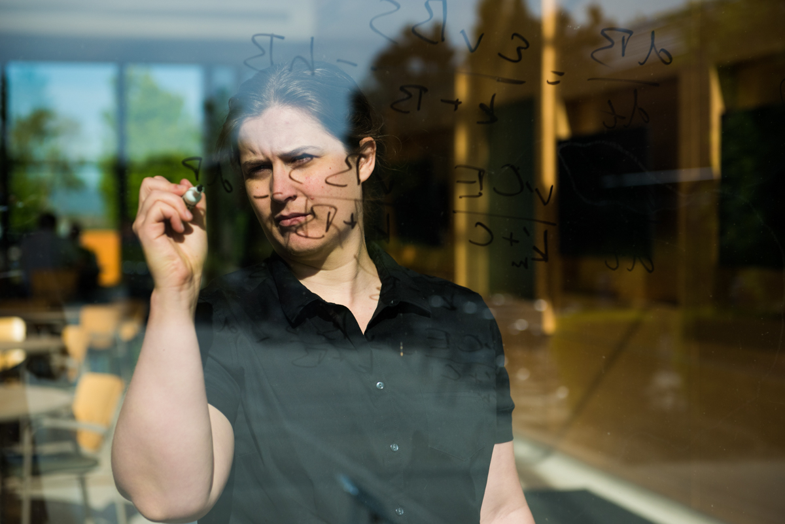

{:height="30%" width="30%"}

I am a computational biogeochemist who uses mathematics and computers to understand how soil breathes. Soils are a major source of natural carbon dioxide (the greenhouse gas driving current climate change); soils are expected to emit more carbon dioxide as climate gets warmer, potentially creating a vicious feedback cycle.
By using data from multiple worldwide studies and simplifying or expanding the complexity of soil models to interoperate that data, I strive to give society a better understanding of this critical climate response. 
As we continue to move towards data-rich research, informatics skills to archive, increase discoverability, and harmonize different data streams become more and more important.
Through my work with the International Soil Carbon Network, I’m working with collaborators across the global to address harmonization issues in soils.

I am an Assistant Professor at the University of Florida in the Department of Environmental Engineering Sciences.
I have been a Postdoctoral Fellow (2019) with Drs Jennifer Baltzer (Wilfred Laurier University) and Merriett Turetsky (Guelph University), a Distinguished Linus Pauling Postdoctoral Fellow at the Pacific Northwest National Lab (a United States Department of Energy laboratory in Richland, Washington) (2015-2018), and a Postdoctoral Researcher at the University of Oklahoma (2014). 
I received my PhD (2013) from the University of California, Irvine from the Earth System Science Department. I also hold a Bachelor of Science (2004) from Harvey Mudd College in Claremont, California in Mathematics and I have worked as a software developer for bioinformatics tools at Massachusetts General Hospital in Boston, Massachusetts.

Thoughts and opinions on here are my own and do not reflect those of my employer, mentors, minions, pets, or other parties.
