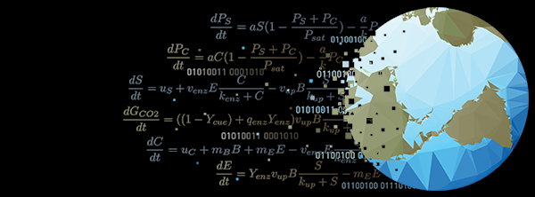

The intersection between climate and the environment is particularly relevant as the world responds to anthropogenic greenhouse gas emissions, in particular CO2.
Climate (or Earth system) models provide the best insights into the effects of increases in greenhouse gas on regional climate patterns.
Soils play a critical role in the global carbon cycle and are important to represent in Earth system models.

Soil organic carbon is expected to convert to atmospheric CO2 faster under warmer and, generally, wetter climates.
This has the potential to increase atmospheric carbon dioxide levels, which in turn exacerbates climate change, creating a vicious feedback.
Lower soil organic carbon levels will also negatively affect water retention and nutrient content of soils. 
While soils are particularly important for understanding climate, they play a critical role more broadly in society.

Capturing the carbon cycle narrative and putting it into a model requires first translating it into math.
How we formulate these equations reflects not only how we think soils behave now, but also how we think they will behave in the future.
One of the big challenges in soil modeling right now is that we know the underlying processes in soils are often non-linear _but_ they seem to behave linearly as an integrated system.
No one quite knows why.

These models need data to make predictions and test different theories about how soils work.
Despite living in an increasingly date rich world, much of the soil data that is out there is not in a form that can easily cross-talk or be integrated into models.
Getting data to talk requires everyone interested in soils (researchers, land managers, and other stakeholders) to sit down and hammer out what exactly we mean when we talk about this amazing system.

Computational soil biogeochemistry is an amazing field of research with lots of exciting opportunities for interdicplinary work spanning biology, geology, hydrology, chemistry, informatics, mathematics, and numerous sub-discipline.
[My lab at the University of Florida](https://www.essie.ufl.edu/people/name/kathe-todd-brown/) frequently has openings for undergraduate and graduate student researchers and I'm always delighted to talk about other potential collaborations.